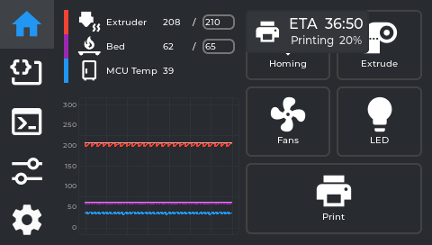
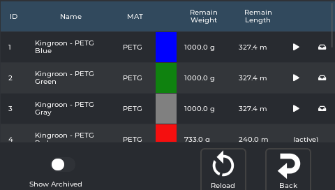

# OpenKE — perfect prints on the Ender-3 V3 KE

**OpenKE turns a stock Creality Ender-3 V3 KE into a properly dialed-in Klipper printer** — a fast
touchscreen UI, the print-quality mods that actually matter, and plain-English guides, all set up by one
installer.

<p align="center">
  <a href="https://github.com/coreflake1/guppyscreen/releases"></a>
  <a href="https://github.com/coreflake1/guppyscreen/actions"></a>
  <a href="./LICENSE"></a>
  <a href="https://discord.gg/wSmZcMtMdm"></a>
</p>

It bundles three things people usually hunt down separately:

- 🖥️ **A fast touch UI** — replaces the stock screen with full print control, an interactive 3D bed
  mesh, and an on-screen calibration suite. Runs right on the printer's display (no X11, Wayland, or
  display server) on top of [Klipper](https://www.klipper3d.org/) and
  [Moonraker](https://github.com/Arksine/moonraker). The UI is a KE-focused fork of
  [GuppyScreen](https://github.com/ballaswag/guppyscreen).
- 🔧 **The Klipper mods that actually improve prints** — adaptive meshing + purge (KAMP), Axis Twist
  Compensation, TMC Autotune, skew correction, and more — vendored in and set up by the installer, not
  scattered across a dozen repos.
- 📚 **Plain-English guides** — how to *dial the printer in*, not just which button does what.

## Features

- 🖨️ **Print control & status** — temps, fans, LED, movement/homing, file browser (incl. USB sticks), Spoolman
- 🟦 **Interactive 3D bed mesh** — rotate / zoom / pan colour height map (plus a table view)
- 🎯 **On-screen calibration suite** — Axis Twist wizard, Skew Correction, TMC Autotune, live Z-offset baby-stepping, input-shaper & belt graphs
- 🎚️ **Fine-tune mid-print** — speed, flow, Z-offset, pressure advance (firmware retraction is its own panel)
- 📷 **Camera** — persistent image tuning (contrast/saturation) on the stock camera
- 🔔 **Buzzer beeps & songs** — real-pitch `M300`, `PLAY_TUNE` jingles (editable `songs.conf`), soft touchscreen click
- 🔌 **Power-loss recovery**, **WiFi low-latency** toggle, on-screen notifications
- 🔒 **Print-state safety locks** — anything that could ruin a running job is blocked or asks first
- 📐 Tuned **480×272** layout, with the screen mounted the right way up

> Full screen tour: **[Using OpenKE](wiki/Using-GuppyKE.md)** · complete change history: **[Releases](https://github.com/coreflake1/guppyscreen/releases)**

## Install

> ⚠️ **Back up your printer config first.** The installer changes init scripts, `printer.cfg`, and some
> Klipper extras. It keeps backups in `/usr/data/guppyify-backup/`, but keep your own too.

SSH into your printer and run:

```sh
sh -c "$(wget --no-check-certificate -qO - https://raw.githubusercontent.com/coreflake1/guppyscreen/main/scripts/installer.sh)"
```

> Use `installer.sh` — **not** `installer-deb.sh` (that one is for aarch64/Debian and refuses to run on the KE).

**It also offers the print-quality extras** (install all / skip all / choose each): KAMP, Axis Twist
Compensation, TMC Autotune, Skew Correction, Firmware Retraction, Screws Tilt Adjust, the Creality
Nebula camera (image tuning), the Pause/Resume layer-shift fix, and the Creality macros (M600, Save
Z-Offset, useful macros, Exclude Object). Already set some up by hand or via the **Creality Helper
Script**? It detects and **skips** those — safe to run on an existing setup, and re-running it **merges
into your existing settings rather than overwriting them**, so nothing you've already configured (on
the screen or in Klipper) gets reset.

**Updating:** from the screen, **Settings → Update Guppy**. Coming from an older version (or "GuppyKE")?
See **[Upgrading](https://github.com/coreflake1/guppyscreen/wiki/Upgrading)**.

**Uninstall:** re-run the command above with `uninstall` appended. Details: **[Installation](https://github.com/coreflake1/guppyscreen/wiki/Installation)**.

### Testing bleeding-edge builds

> ⚠️ **Unstable, for testers only.** This is the `ke-next` development branch — it can contain
> half-finished or experimental work between releases. Don't run this on a printer you rely on for
> real prints unless you're comfortable recovering it yourself.

Every push here builds automatically and publishes to a moving `nightly-ke-next` prerelease. To
install the latest one:

```sh
PINNED_RELEASE=nightly-ke-next sh -c "$(wget --no-check-certificate -qO - https://raw.githubusercontent.com/coreflake1/guppyscreen/ke-next/scripts/installer.sh)"
```

To go back to the latest stable release, just re-run the normal install command above (no
`PINNED_RELEASE`). More detail: **[Installation](wiki/Installation.md#testing-bleeding-edge-builds-ke-next-nightly)**.

## Compatibility

| | |
|---|---|
| **Printer** | Creality Ender-3 V3 KE |
| **SoC / arch** | Ingenic XBurst2 X2000 — **MIPS (mipsel)**, *not* aarch64 |
| **Display** | 480×272 |

Built and verified for the **Ender-3 V3 KE**. Other boards/screens can be built from source but aren't the focus.

**Mounting the screen:** the 3D-printable bracket I use to attach the display to the printer is on
Thingiverse — **[Ender-3 V3 KE screen mount](https://www.thingiverse.com/thing:6617266)**.

Want the screen closer to its original stock position (still landscape)? **@DylanUnofficial** made an
alternative — **[Nebula screen mount](https://www.printables.com/model/1770386-creality-ender-3-v3-ke-openke-nebula-screen-mount)**
on Printables. Thanks Dylan!

## Screenshots

> Captured live from a real Ender-3 V3 KE at its native 480×272 — not the simulator. Many more, covering
> every screen in the app, are in the [screen reference](https://github.com/coreflake1/guppyscreen/wiki/Using-GuppyKE).

| | |
|:---:|:---:|
| **Home** | **Tune menu** |
|  |  |
| **Interactive 3D bed mesh** | **Print status** |
|  |  |
| **Skew Correction** | **Spoolman** |
|  |  |

## Documentation

Full documentation lives on the **[GitHub Wiki](https://github.com/coreflake1/guppyscreen/wiki)**. Highlights:

- [Calibration walkthrough (start here)](https://github.com/coreflake1/guppyscreen/wiki/Calibration-Explained)
- [Installation](https://github.com/coreflake1/guppyscreen/wiki/Installation) · [Upgrading from an older version](https://github.com/coreflake1/guppyscreen/wiki/Upgrading)
- [Axis Twist Compensation](https://github.com/coreflake1/guppyscreen/wiki/Axis-Twist-Compensation) · [Adaptive meshing (KAMP)](https://github.com/coreflake1/guppyscreen/wiki/Adaptive-Meshing-KAMP) · [Skew Correction](https://github.com/coreflake1/guppyscreen/wiki/Skew-Correction) · [TMC Autotune](https://github.com/coreflake1/guppyscreen/wiki/TMC-Autotune)
- [Camera image tuning](https://github.com/coreflake1/guppyscreen/wiki/Camera-Image-Tuning)
- [Troubleshooting](https://github.com/coreflake1/guppyscreen/wiki/Troubleshooting) · [Resetting & uninstalling](https://github.com/coreflake1/guppyscreen/wiki/Resetting-and-Uninstalling) · developer docs: [Building from Source](https://github.com/coreflake1/guppyscreen/wiki/Building-from-Source), [Architecture](https://github.com/coreflake1/guppyscreen/wiki/Architecture)

> The wiki pages are also maintained as Markdown in [`wiki/`](wiki/) in this repo and auto-published to the Wiki tab.

## Build from source

```bash
git clone --recurse-submodules https://github.com/coreflake1/guppyscreen.git
```

The desktop simulator (try the UI with no printer) and the MIPS cross-build for the KE are both covered in
**[Building from Source](https://github.com/coreflake1/guppyscreen/wiki/Building-from-Source)**. The cross-build runs in this repo's toolchain
container (`docker/Dockerfile`, published as `ghcr.io/coreflake1/guppydev`).

## License & credits

**GPL-3.0** — see [LICENSE](./LICENSE). The touch UI builds on
[ballaswag/guppyscreen](https://github.com/ballaswag/guppyscreen),
[probielodan/guppyscreen](https://github.com/probielodan/guppyscreen), and
[pellcorp/grumpyscreen](https://github.com/pellcorp/grumpyscreen), with the 3D bed mesh from
[prestonbrown/guppyscreen](https://github.com/prestonbrown/guppyscreen). Vendored Klipper mods keep their
own upstream licenses and credits — see [Contributing](https://github.com/coreflake1/guppyscreen/wiki/Contributing). *(Formerly "GuppyKE".)*
