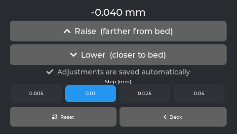
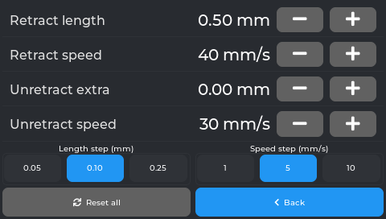
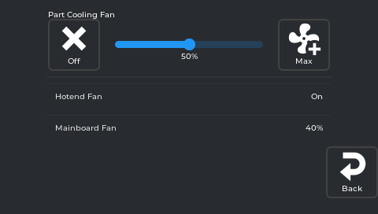
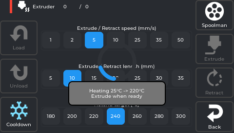
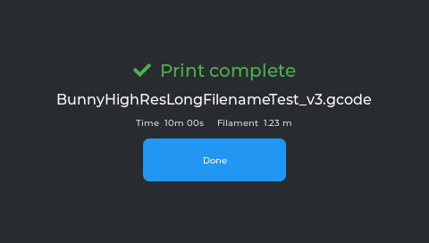
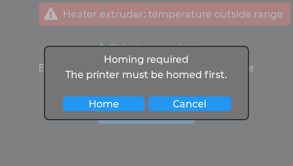

# GuppyScreen — Ender-3 V3 KE Edition

A fast, standalone touch UI for your **Creality Ender-3 V3 KE**, powered by [Klipper](https://www.klipper3d.org/)
and [Moonraker](https://github.com/Arksine/moonraker). It runs directly on the printer's screen — no
X11, Wayland, or display server required — and replaces the stock interface with full print control,
calibration tools, and an interactive 3D bed mesh.

This is a KE-focused fork of [GuppyScreen](https://github.com/ballaswag/guppyscreen). Current release:
**GuppyKE (`v0.3.0-GuppyKE`)**.

<p align="center">
  <a href="https://github.com/coreflake1/guppyscreen/releases"></a>
  <a href="https://github.com/coreflake1/guppyscreen/actions"></a>
  <a href="./LICENSE"></a>
</p>

---

## Features

- 🖨️ **Print control & status** — temperatures, fans, LED, movement, homing
- 🟦 **Interactive 3D bed mesh** — colour height map you can rotate, zoom, and pan (plus a table view)
- 📈 **Input shaper & belt calibration** with PSD graphs
- 🎚️ **Fine tune mid-print** — speed, flow, Z-offset, pressure advance
- 📂 File browser (with USB thumb-drive support), macro/console shell, Spoolman, TMC metrics
- 🔒 **Print-state safety locks** — panels that could ruin a running job are blocked or confirmed mid-print
- 📐 Tuned **480×272 layout** with the screen mounted the right way up

## What's new in the GuppyKE edition

Built on [ballaswag/guppyscreen](https://github.com/ballaswag/guppyscreen) and
[probielodan/guppyscreen](https://github.com/probielodan/guppyscreen), with the 3D bed mesh from
[prestonbrown/guppyscreen](https://github.com/prestonbrown/guppyscreen). On top of those, this edition adds:

**New panels & tools**
- **Live Z-Offset baby-stepping** — dedicated panel (Tune tab, or tap the Z-offset metric mid-print) with
  0.005 / 0.01 / 0.025 / 0.05 mm steps, Raise/Lower, Reset. Adjustments save automatically (see setup below),
  and are blocked with a "Home first" prompt when the printer isn't homed.
- **Firmware Retraction** live-tuning panel — edit retract length/speed and extra unretract on the fly, with
  clear toasts when `[firmware_retraction]` isn't configured.
- **Tap-to-exclude object map** — cancel a single failed object by tapping it on a live bed map during a print.
- **Console** redesigned as a drill-down command browser (history, favourites, quick-filter groups).
- **Macros** redesigned — favourites, collapsible rows, button navigation; jumps to the console when a macro runs.
- **Power Settings** (renamed from Power Devices) with **Power Loss Recovery** — after a mid-print power
  outage, resume the interrupted print from where it stopped (uses the printer's saved breakpoint).

**Improved UX**
- **On-screen notifications** — Klipper events surface as toasts, with separate modals and a dedicated
  print-done screen.
- **Fans** — friendly names, read-only fans (heater_fan / output-pin fans) shown, correct editable/read-only split.
- **Print status / home** — bigger preview-led print overlay, a compact mini-overlay on the home screen, and a
  "Paused" chip; ETA now matches Mainsail by averaging the file/filament/slicer estimates.
- **Mid-print safety** — view the bed mesh during a print (mutating actions blocked); Homing/Extrude allowed
  while paused with the overlay hidden.
- **Adaptive bed mesh rendering** — the table and 3D views now render correctly for KAMP adaptive meshes and
  denser grids (true bed position/aspect, bed outline, fill-to-canvas), not just the stock 5×5.
- **Extruder** — filament actions heat to the selected temperature first, with clearer labels and feedback.
- **Spoolman** — confirm the active filament at print start.

**Under the hood**
- Smoother scrolling on the KE's resistive **ns2009** touch panel (EMA-smoothed input).
- Thread-safe `State` access, tightened LVGL cadence, and an evdev tracking-id fix.
- A self-hosted MIPS cross-build toolchain and CI that publishes KE release tarballs.

## Screenshots

> Captured in the desktop simulator at the KE's native 480×272.

| | |
|:---:|:---:|
| **Home** | **Live Z-Offset** |
|  |  |
| **Firmware Retraction** | **Tune menu** |
|  |  |
| **Fans** | **Extruder** |
|  |  |
| **Print complete** | **Notifications & homing prompt** |
|  |  |

## Compatibility

| | |
|---|---|
| **Printer** | Creality Ender-3 V3 KE |
| **SoC / arch** | Ingenic XBurst2 X2000 — **MIPS (mipsel)**, *not* aarch64 |
| **Display** | 480×272 |

> This fork is built and verified for the **Ender-3 V3 KE**. Other boards/screens can be built from
> source but are not the focus here.

## Install

> ⚠️ **Back up your printer config first.** The installer changes init scripts, `printer.cfg`, and some
> Klipper extras (it keeps backups in `/usr/data/guppyify-backup/`, but keep your own too).

SSH into your printer and run:

```sh
sh -c "$(wget --no-check-certificate -qO - https://raw.githubusercontent.com/coreflake1/guppyscreen/main/scripts/installer.sh)"
```

> Use `installer.sh` — **not** `installer-deb.sh` (that one is for aarch64/Debian and will refuse to
> run on the KE).

### Updating

From **v0.3.0 onward**, update in place from the screen: **Settings → Update Guppy** (it pulls the
latest release and restarts).

> **Upgrading from v0.2.0 (one-time):** the v0.2.0 in-app updater points at the wrong repository and
> can't fetch GuppyKE releases, so the **Update Guppy** button won't work on 0.2.0. Just re-run the
> install command above once — it pulls the latest release, replaces the updater with the fixed one,
> and **keeps your printer config**. After that, the on-screen Update button works for every future
> release.

### Uninstall

```sh
sh -c "$(wget --no-check-certificate -qO - https://raw.githubusercontent.com/coreflake1/guppyscreen/main/scripts/installer.sh)" uninstall
```

Full details (exactly what changes, what is/isn't restored): **[Installation](wiki/Installation.md)**.

## Required printer setup (Klipper & Creality Helper Script)

GuppyKE drives features that depend on Klipper/Moonraker config. Most KE setups install these through the
**[Creality Helper Script](https://github.com/Guilouz/Creality-Helper-Script)** — see its
**[Wiki](https://guilouz.github.io/Creality-Helper-Script-Wiki/)**. The screen still runs without them; the
related panels just show an empty/disabled state.

**Mandatory for the matching feature**

| Feature in GuppyKE | What it needs | Where |
|---|---|---|
| **Z-Offset saved between reboots** | Helper Script → **Save Z-Offset Macros** (overrides `SET_GCODE_OFFSET` to mirror every change into `variables.cfg`). Without it the panel still adjusts live, but the value is **not** persisted. | [Save Z-Offset Macros](https://guilouz.github.io/Creality-Helper-Script-Wiki/helper-script/save-z-offset-macros/) |
| **Firmware Retraction panel** | A `[firmware_retraction]` section in `printer.cfg` (added manually — it is not a Helper Script toggle). | [Klipper docs](https://www.klipper3d.org/Config_Reference.html#firmware_retraction) |
| **Tap-to-exclude object map** | `[exclude_object]` in Klipper **and** `enable_object_processing: True` in `moonraker.conf` (both come with the Helper Script's updated Moonraker). | [Moonraker (updated)](https://guilouz.github.io/Creality-Helper-Script-Wiki/helper-script/moonraker-ender3/) |

**Recommended for the full experience**

| Adds | Helper Script option |
|---|---|
| Filament-change / `M600` support (used by the console + filament actions) | [M600 Support](https://guilouz.github.io/Creality-Helper-Script-Wiki/helper-script/m600-support/) |
| A library of macros for the Macros panel | [Useful Macros](https://guilouz.github.io/Creality-Helper-Script-Wiki/helper-script/useful-macros/) |
| Better input-shaper calibration graphs | [Improved Shapers Calibrations](https://guilouz.github.io/Creality-Helper-Script-Wiki/helper-script/improved-shapers-calibrations/) |
| Manual bed-tramming helper | [Screws Tilt Adjust Support](https://guilouz.github.io/Creality-Helper-Script-Wiki/helper-script/screws-tilt-adjust-support/) |

## Documentation

Everything beyond installing lives in the **[`wiki/`](wiki/Home.md)** docs:

- [Installation](wiki/Installation.md) — install/uninstall and what it changes
- [Configuration](wiki/Configuration.md) — `guppyconfig.json` and build options
- [Building from Source](wiki/Building-from-Source.md) — submodules, simulator, MIPS cross-build
- [Development & Simulator](wiki/Development-and-Simulator.md) — local dev workflow
- [Architecture](wiki/Architecture.md) — how it's put together
- [Troubleshooting](wiki/Troubleshooting.md) · [Known Issues](wiki/Known-Issues.md) · [Contributing](wiki/Contributing.md)

## Build it yourself (quick start)

```bash
git clone --recurse-submodules https://github.com/coreflake1/guppyscreen.git
cd guppyscreen
```

- **Desktop simulator** (try the UI without a printer) and **MIPS build for the KE** are both covered in
  [Building from Source](wiki/Building-from-Source.md).
- The MIPS cross-build runs in a toolchain container. This repo ships its own
  [`docker/Dockerfile`](docker/Dockerfile), published as `ghcr.io/coreflake1/guppydev` — see
  [Building from Source](wiki/Building-from-Source.md).

## License & credits

Licensed under **GPL-3.0** — see [LICENSE](./LICENSE).

Built on [ballaswag/guppyscreen](https://github.com/ballaswag/guppyscreen) and
[probielodan/guppyscreen](https://github.com/probielodan/guppyscreen), with the 3D bed mesh from
[prestonbrown/guppyscreen](https://github.com/prestonbrown/guppyscreen). Full credits in
[Contributing](wiki/Contributing.md).
