# Screen Reference — Every Panel, Every Setting

Plain-English reference for every screen in OpenKE. If you're looking at something and wondering
"what does this do?" — find it here.

> 🔒 **You can't break a running print by exploring the screen.** Anything that would interrupt a job is
> blocked or asks you to confirm first. Tap around freely.

---

## Getting around — the five tabs

A column of icon buttons runs down the **left edge** of the screen. Tap one to switch. Tapping the
already-active tab resets it (Macros jumps back to favourites, Console clears the input).

| Tab | What's here |
|---|---|
| 🏠 **Home** | Temperatures, graph, and the buttons you use every day |
| **Macros** | Your Klipper gcode macros |
| **Console** | Type gcode directly or browse commands |
| **Tune** | Grid of calibration tool launchers |
| **Settings** | Grid of system panel launchers |

> **Both Tune and Settings work the same way:** each is a grid of large icon buttons. Tapping one opens
> a full-screen sub-panel. Nothing is adjusted or configured inline on these tabs themselves.

---

## 🏠 Home tab

Your everyday screen. Inline content — no launcher grid.

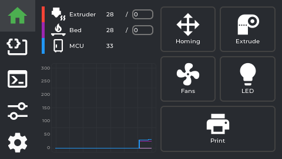

### Temperature panel

Shows live read-outs with target values for whichever sensors are configured in `guppyconfig.json`
(`monitored_sensors`) — by default **nozzle, bed, and MCU**. A **chamber** sensor also appears here,
but only if one is set up in your printer's config with the display name "Chamber" — it is not shown
by default on a stock KE.

- **Tap any temperature** to set a target (preheat). A numpad opens. The reading shows current/target
  — e.g. `45 / 210` means currently 45 °C, heating toward 210 °C.
- There are no material presets (no PLA/PETG/ABS quick-select buttons) — type the exact temperature
  you want on the numpad.
- **Tap the target** to clear it (set to 0 — cool down / off).
- Chamber and MCU are display-only (no heater to control).

### Temperature graph

A rolling line chart of all monitored temperatures, colour-coded. Useful for watching whether a heater
is stable at target or still swinging.

### Action buttons

Five icon buttons below the temperatures. Each opens a **floating panel** over the current screen:

| Button | Opens |
|---|---|
| **Homing** | Movement panel (jog + home axes) |
| **Extrude** | Filament panel (load/unload + manual extrude) |
| **Fans** | Fan speed controls |
| **LED** | Case light controls |
| **Print** | File browser |

---

## Homing panel (movement)

Opens from the Home tab **Homing** button.

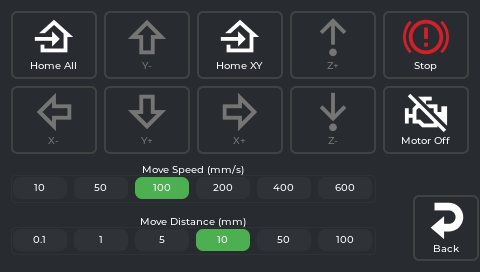

### Jog controls

- **Move Distance selector:** 0.1 mm / 1 mm / 5 mm / 10 mm / 50 mm / 100 mm — how far each direction tap moves.
- **Move Speed selector:** 10 / 50 / 100 / 200 / 400 / 600 mm/s — how fast that move happens.
- **X−/X+, Y−/Y+, Z−/Z+** — move the toolhead by the selected distance, at the selected speed. On the
  KE (bed-slinger), Y moves the bed.
- There is **no live position readout** on this panel — the app tracks position internally (to stop you
  jogging past the axis limits) but doesn't display X/Y/Z coordinates anywhere on screen.

> ⚠️ The printer doesn't know where it is until it homes. Moving before homing can crash the toolhead.
> Use the Home buttons below first.

### Home / Stop buttons

| Button | What it does |
|---|---|
| **Home All** | G28 — homes X, Y, and Z |
| **Home XY** | Homes X and Y only, leaving Z where it is |
| **Stop** | Emergency stop — asks "Do you want to emergency stop?" first, then cuts power to motors/heaters immediately if confirmed. Same underlying action as the print-status screen's Emergency Stop. |

There is no button to home a single axis (X, Y, or Z) by itself — only the two combined options above.

### Motors off

Disables stepper motors so you can move the toolhead and bed by hand. They re-engage on the next move
command or home.

### Invert Y toggle

Flips which direction Y+ and Y− move the bed. Some users find the default unintuitive on a bed-slinger.
Toggle to match your mental model. (Also settable permanently in Settings → System → Invert Y Direction.)

---

## Filament panel (extruder)

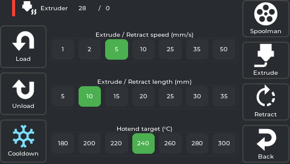

Opens from the Home tab **Extrude** button. Six buttons in total — **Load**, **Unload**, **Cooldown**
on the left; **Spoolman**, **Extrude**, **Retract**, **Back** on the right — plus three preset
selectors in the middle: **Hotend target (°C)**, **Extrude/Retract length (mm)**, and **Extrude/Retract
speed (mm/s)**.

> **Note:** the hotend target here is a fixed list (180 / 200 / 220 / 240 / 260 / 280 / 300 °C), not the
> free-entry numpad you get by tapping the temperature on the Home tab. If you want an exact value like
> 215 °C, set it from the Home tab instead — this selector only offers those 7 presets.

### Load

Heats the nozzle to the selected target, feeds filament forward. If Spoolman is active, a **"Use this
filament?"** confirmation appears first. While it's running, there's no separate Stop button — the
on-screen message tells you to **"Tap Cooldown to stop"**, and Cooldown stays active for exactly that
while every other button is disabled. After loading finishes, the nozzle auto-cools.

> Start Load when your filament is already inserted into the extruder throat. Tap Cooldown once plastic
> coming out the nozzle runs clean and consistent.

### Unload

Heats the nozzle, retracts filament fully out of the bowden/throat, then auto-cools. Remove the
filament from the top of the extruder manually after.

### Cooldown

Immediately sets the hotend target to 0. Also doubles as the way to interrupt an in-progress Load (see
above) and stays tappable while the hotend is heating toward a pending Extrude/Retract, so you can
cancel that too.

### Spoolman

Shortcut straight to the [Spoolman panel](#spoolman-panel) — same one reachable from Settings.

### Manual extrude / retract

For precise manual movement once the nozzle is already hot:

- **Extrude/Retract length (mm)** — how far each press moves: 5 / 10 / 15 / 20 / 25 / 30 / 35
- **Extrude/Retract speed (mm/s)** — how fast: 1 / 2 / 5 / 10 / 25 / 35 / 50
- **Extrude / Retract** buttons — each press moves that amount once, at that speed

The nozzle must be at temperature (Klipper enforces this) — tapping Extrude/Retract while cold heats it
first, then runs the move once it's up to temperature. Also auto-cools after each operation.

---

## Fan panel

Opens from the Home tab **Fans** button.

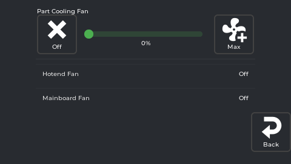

There are two very different kinds of row here, and which one you get depends on whether the fan is
listed in `guppyconfig.json`'s `fans` setting:

- **Fans listed in `fans`** (by default, just the **Part Cooling Fan**) get a full editable control:
  an **Off** button, a **0–100% slider**, and a **Max** button. Changes apply immediately and override
  whatever gcode was sending. 0% for the first layer of ABS/ASA; 100% for PLA/PETG bridges.
- **Everything else Klipper reports as a fan** (typically the **Hotend Fan** and **Mainboard Fan** —
  Klipper's `heater_fan`/`controller_fan` types) shows as a **plain read-only row**: just the name and
  its current "On"/"Off" state, with **no slider or toggle at all**. These are auto-managed by Klipper
  based on temperature — you cannot control them manually from this screen.

If you want a fan that currently shows as read-only to become adjustable, add it to `fans` in
`guppyconfig.json` — see [Configuration](Configuration).

---

## LED panel

Opens from the Home tab **LED** button.

Each LED/light Klipper reports appears as a row with **Off**, a brightness slider, and **Max** — unless
it's a simple on/off light (no PWM dimming), in which case the slider is hidden and you get **Off**/**On**
only. **If your printer.cfg has no `[led]`/`[neopixel]`/output-pin light section at all, this screen is
completely empty** except the Back button — there's no "nothing configured" message, it's just blank.
This is common: not every KE has a case light wired into Klipper, so don't be surprised if yours is empty.

---

## File browser (Print)

Opens from the Home tab **Print** button.

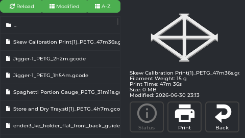

- Lists `.gcode` files from internal storage and any plugged-in USB stick. A `..` row at the top lets
  you go up a folder.
- Three buttons above the list: **Reload** (re-fetches the file list from the printer — also resets the
  sort, see below), **Modified**, and **A-Z** (the two sort options).
- **Tap a file** to preview it on the right: thumbnail (if the slicer generated one), file name,
  **Filament Weight**, **Print Time**, **Size**, and **Modified** (date/time).
- Three buttons below the preview: **Status** (jumps straight to the full print-status screen — only
  enabled while a print is actually running or paused), **Print** (starts this file), and **Back**.
- Files sort by date (newest first) by default. Tapping a sort button changes it for that visit, but
  it resets back to date/newest-first every time you re-open the file browser — it is **not** remembered
  between opens.
- USB files load full metadata (print time, filament weight) via a metascan on first access.

---

## Print status screen

Appears automatically (pops to the front) the moment a print starts, no matter which tab you're on. If
you navigate away from it back to the **Home tab** while printing, a compact progress widget appears
there in place of the usual action buttons — tap it to bring the full print status screen back. This
shortcut only appears on the Home tab, not on Macros/Console/Tune/Settings.

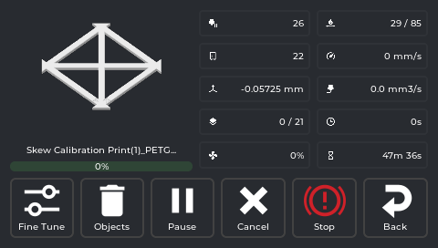

Thumbnail, file name, and a progress bar sit on the left. On the right is a fixed **5-row × 2-column**
grid, in this exact order:

| Row | Left column | Right column |
|---|---|---|
| 1 | **Extruder temp** — current, or `current / target` while a target is set | **Bed temp** — same current/target format |
| 2 | **Chamber temp** — same format. **Always shown here, even if you don't have a "Chamber" sensor configured** (unlike the Home tab, which hides it in that case) | **Speed** — current print speed in mm/s |
| 3 | **Z-offset** — tap this one specifically to open the baby-stepping panel right here | **Flow** — volumetric flow rate in mm³/s (not the same thing as the Fine Tune panel's flow **percentage**) |
| 4 | **Layers** — always `current / total` | **Elapsed** time |
| 5 | **Fan speed(s)** — if more than one fan is relevant, shown comma-separated | **Time left** (estimate) |

Pressure Advance and total filament used are **not** shown on this screen. Pressure Advance can be
adjusted live from the **Tune tab → Fine Tune** panel while a print is running; filament used is
tracked internally to estimate the time remaining, but there's no on-screen readout for it.

### Baby-stepping Z-offset while printing

Tap the **Z-offset readout** to get step buttons (±0.001, ±0.005, ±0.01, ±0.025, ±0.05 mm). Nudge while
watching the first layer:

- **Lines not fusing / gaps:** too high — lower (−)
- **Lines translucent or completely flat:** too low — raise (+)
- **Squished together and fused, no gaps:** correct

Saves automatically.

### Control buttons

Six buttons in total: **Fine Tune**, **Objects**, **Pause** (becomes **Resume** once paused), **Cancel**,
**Stop**, **Back**.

| Button | What it does |
|---|---|
| **Fine Tune** | Shortcut straight to the [Fine Tune panel](#fine-tune) — same one reachable from the Tune tab. |
| **Objects** | Opens the [Exclude Object screen](#exclude-object-screen) below. |
| **Pause / Resume** | Parks the toolhead, holds temperatures. **Resume** brings it back and continues. |
| **Cancel** | Cancels the print. Shows a red Confirm dialog. For the very last remaining object (Exclude Object), shows a "Cancel print?" confirmation. |
| **Stop** | The button's actual label is just **"Stop"**, not "Emergency Stop" — but it is the same emergency-stop action as everywhere else in the app. Cuts all movement and heaters immediately. Use only if something is going wrong physically. Requires a power-cycle or `FIRMWARE_RESTART` to recover. |

---

### Exclude Object screen

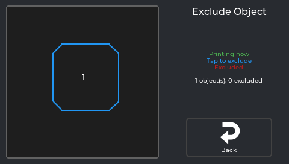

Opens from the print status screen's **Objects** button — only useful for gcode files sliced with
object labels (the same "Label Objects" slicer setting adaptive meshing relies on). Shows each object as a shape you
can tap: green means **"Printing now"**, plain means **"Tap to exclude"**, red means **"Excluded"**.
Skipping an object stops printing it partway through without cancelling the whole job — useful if one
part of a multi-part print has failed but the rest is still going well. A counter below the legend
reads exactly **"N object(s), N excluded"**.

---

## Macros tab

All your Klipper gcode macros, accessible from the screen. Inline content — no launcher grid.

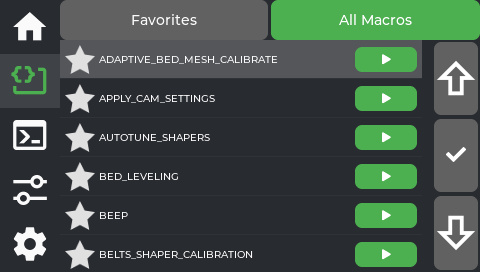

- **Favorites / All Macros** — a segmented toggle at the top switches between the two views. Favorites
  (the default) shows only macros you've pinned; if you have none yet, it says "No favorites yet. Open
  All Macros and tap the star to add." Tapping the Macros tab again while already on it jumps back to
  Favorites.
- **All Macros is a flat, alphabetical list — not grouped by category.** Each row has a ☆ star (tap to
  pin/unpin as a favorite) and a green ▶ button that runs that macro immediately.
- **Up / ✓ / Down column** on the right — this is a separate navigation aid, not a scrollbar: **Up**/
  **Down** move a highlight cursor through the list one row at a time, and **✓** expands (or collapses)
  the currently highlighted macro's parameter inputs, scrolling it into view. You can also just tap a
  macro's row directly with your finger to expand it — the ✓ column is an alternative for precise
  selection, not the only way in.
- **Parameters** — once expanded (by tapping the row or via ✓), fill in the parameter inputs before
  running, or leave defaults as-is.

---

## Console tab

Direct gcode access. Inline content — no launcher grid. **Opens on the terminal view by default** —
tapping the Console tab again while already on it resets back to this terminal view too.

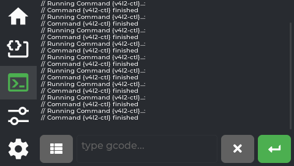

### Direct input (the default view)

Type any gcode command directly, same as the Mainsail terminal.

- **History** — last 100 entries. Temperature-spam lines (`T:210 B:60 …`) are filtered so they don't
  flood the history. Tap a history entry to re-run it.
- The small **list icon** to the left of the text field (not a separate tab) is how you get to the
  Command Browser described below.

### Command browser

Reached by tapping the **list icon** next to the text field on the terminal view — it isn't a separate
tab of its own.

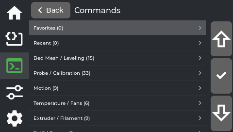

The category list always starts with **Favorites** and **Recent**, followed by keyword-based groups
(Bed Mesh/Leveling, Probe/Calibration, Motion, Temperature/Fans, Extruder/Filament, and more), each
showing a command count. Two things worth knowing about the first two:

- **Favorites here are separate from the Macros tab's favorites** — this is its own star list, specific
  to gcode commands in this browser, with its own empty-state message ("No favorites yet. Star commands
  in any list.").
- **Recent is shared history with Fluidd** — it's not tracking only what you've run from this screen;
  it reflects command history from other interfaces too, if you use them.

The same **Up / ✓ / Down** navigation column from the Macros tab appears here too (see
[Macros tab](#macros-tab) for what it does).

Drill-down interface: tap a **category** → see commands in it. **There is no third "detail" level with
a description and its own Run button** — tapping a command inserts its name straight into the
terminal's input field and switches you back to the terminal view, keyboard already open, cursor at
the end so you can type any parameters yourself:

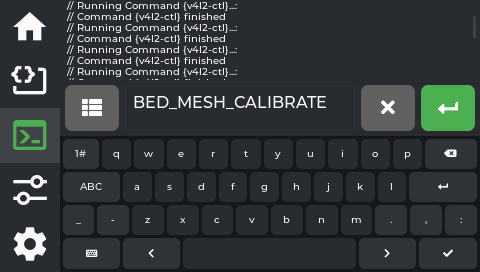

Press the green **↵** button on the terminal to actually run it. This is really a fast way to look up
and insert a command name without typing it from memory, not a guided form. If tapping a command
doesn't seem to do anything, try again with a firm, clean tap — the resistive touchscreen occasionally
misses a light tap.

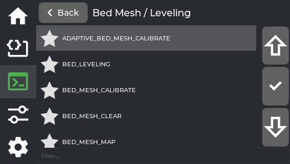

Inside a category, a **filter** box appears at the bottom (only at this level, not on the category list
itself) — type to narrow the list live. Each command here also has its own ☆ star, same favoriting
behavior as the category list.

---

## Tune tab

An **8-tile grid of icon buttons** (4 columns × 2 rows). Tapping a button opens its sub-panel
full-screen. Nothing is adjusted inline on this tab itself.

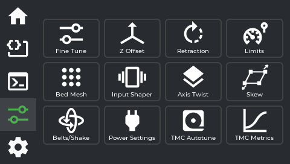

| Row | Col 1 | Col 2 | Col 3 | Col 4 |
|---|---|---|---|---|
| 1 | Fine Tune | Z Offset | Retraction | Limits |
| 2 | Bed Mesh | Power Settings | TMC Metrics | Calibration |

### Fine Tune

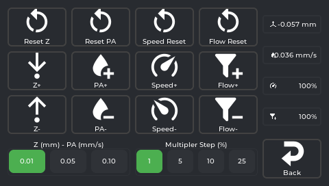

Not sliders — this panel is entirely **+ / − buttons**, each with a matching **Reset** button, usable
during a print or any time. There are two step-size selectors that control how much each button tap
changes: one shared between Z-offset and Pressure Advance (**0.01 / 0.05 / 0.10**), and one for Speed
and Flow together (the "Multiplier Step" — **1 / 5 / 10 / 25%**).

| Control | Buttons | What it does |
|---|---|---|
| **Speed** | Speed+ / Speed− / Speed Reset | Global speed multiplier. 100% = follow slicer speeds exactly. |
| **Flow** | Flow+ / Flow− / Flow Reset | Extrusion multiplier. Under-extruding → raise. Over-extruding → lower. |
| **Pressure Advance (PA)** | PA+ / PA− / Reset PA | Compensates for nozzle pressure lag at speed. Fixes corner bulges and blobs. |
| **Z-offset** | Z+ / Z− / Reset Z | A *third* place to baby-step Z-offset, alongside the print-status readout and the separate Z Offset panel below — all three adjust the same underlying value. |

**Firmware Retraction is not part of this panel** — it's the separate **Retraction** tile on the Tune
tab grid, described below.

### Z Offset

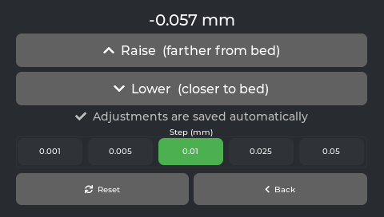

First-layer baby-stepping. Same as tapping Z on the print-status screen, but also usable outside a print.

- **Raise (farther from bed)** / **Lower (closer to bed)** buttons, plus a **Reset** button that sets
  the offset to exactly 0.
- Step size buttons: **0.001 / 0.005 / 0.01 / 0.025 / 0.05 mm**
- Current value shown at top
- There is no separate Save button — every tap (including Reset) adjusts the offset and saves it
  automatically (via the Save Z-Offset macros the installer sets up). You'll see "Adjustments are saved
  automatically" on the panel as a reminder.
- **The printer must be homed first.** If it isn't, you'll get a homing prompt instead of the adjustment
  going through. This isn't just a safety check — an unhomed adjustment would actually change the
  live offset (so the on-screen number would move) but silently fail to move the toolhead or save,
  which would leave the displayed value out of sync with what's actually stored. Homing first avoids that.

### Retraction

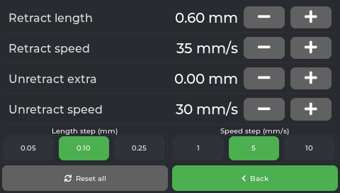

There are **two separate requirements** here, and both have to be true for this to actually do
anything to your prints:

1. **Your Klipper config needs a `[firmware_retraction]` section.** This is what decides whether this
   *panel* shows controls at all — if it's missing, the panel shows an **empty state** instead, and
   there's nothing to accidentally break.
2. **The gcode file you're printing needs to have been sliced with Firmware Retraction turned on** (in
   OrcaSlicer/PrusaSlicer etc., the retraction *type* setting — `G10`/`G11` commands, not the slicer's
   default direct-E-axis retraction). This is a **per-file slicer setting**, completely separate from
   #1. Even with `[firmware_retraction]` configured and this panel showing live values, if the specific
   file you're printing wasn't sliced with Firmware Retraction selected, none of these values are used —
   the print just uses whatever retraction the slicer itself wrote into the gcode instead.

If both are true, you get 4 rows — **Retract length** (mm), **Retract speed** (mm/s), **Unretract
extra** (mm), **Unretract speed** (mm/s) — each with −/+ buttons, plus a **Length step (mm)** selector
(0.05/0.10/0.25) and a **Speed step (mm/s)** selector (1/5/10), and a single **Reset all** button.
Changes apply **immediately** (live, via `SET_RETRACTION`) and are **runtime-only** — like the Limits
panel, nothing here is saved to `printer.cfg`, so a Klipper restart reverts everything to your config
file's values.

### Limits

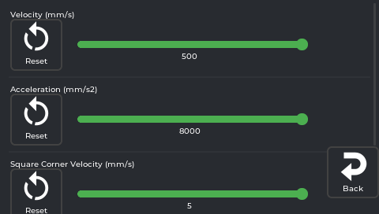

Hard caps on machine speed and acceleration, each shown as a slider with its own **Reset** button
(resets that one value back to what's set in `printer.cfg`, not a fixed factory number):

| Setting (exact on-screen label) | What it is |
|---|---|
| **Velocity (mm/s)** | Hard cap on axis speed |
| **Acceleration (mm/s2)** | Hard cap on acceleration |
| **Acceleration to Deceleration (mm/s2)** | A separate Klipper acceleration cap used specifically when the toolhead needs to slow down; distinct from the general Acceleration above |
| **Square Corner Velocity (mm/s)** | How fast the toolhead turns a sharp corner without fully decelerating |

Dragging any slider (or tapping its Reset) sends the change to Klipper **immediately** — there's no
separate "apply" step. These are **runtime-only**: nothing here is written to `printer.cfg`, so a
Klipper restart puts every value back to whatever `printer.cfg` says, undoing anything you changed here.

Raising these doesn't automatically make prints faster — the slicer's own speeds must also be raised.
Going beyond what the machine can handle causes ringing artifacts.

### Bed Mesh

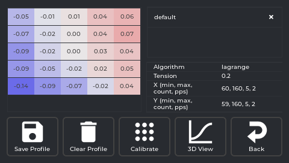

Opens showing a **table of raw Z values** at each probe point by default (colour-shaded — blue is low,
red is high) plus an info panel (Algorithm, Tension, and the X/Y probe range — min, max, count, points
per segment). There's no on/off toggle for mesh compensation; see **Clear Profile** below for how that
actually works.

- **3D View** button — switches to a colour surface you can rotate/zoom instead of the table. Tap again
  to switch back.
- **Calibrate** — runs `BED_MESH_CALIBRATE` (auto-homing first if the printer isn't already homed), maps
  the whole bed fresh (~2–3 min).
- **Save Profile** — saves the *current* mesh permanently under a name you choose, so you can switch
  between multiple saved meshes later.
- **Clear Profile** — runs `BED_MESH_CLEAR`, which turns mesh compensation **off** (this is the closest
  thing to an "off switch" — there's no separate toggle). Calibrating again, or loading a saved profile,
  turns it back on.
- **Saved profiles list** — each saved profile is a row with its name; tap the row to **load** it as
  active, or tap the ✕ on that row to **delete** it permanently.

#### 3D View screen

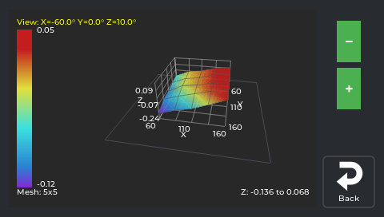

- **Drag anywhere on the mesh** to rotate it — the angle readout in the top-left (`View: X=... Y=...
  Z=...`) updates live as you drag.
- The colour scale on the left maps colour to height (red = high, blue = low); the exact range and the
  mesh size (e.g. "Mesh: 5x5") are shown with it.
- **The +/− buttons on the right have two different jobs depending on how you press them** — this is
  the only place in the app where that's true:
  - **Short tap** zooms the whole view in/out (like moving the camera closer/further).
  - **Press and hold** instead exaggerates or flattens the **height** of the surface — makes bumps
    look taller (hold +) or flatter (hold −) — without changing how sensitive the colours are. It
    keeps changing for as long as you hold it.
- **Back** here returns you to the Table view, not out of Bed Mesh entirely — tap it again from the
  table to actually leave the panel.

### Power Settings

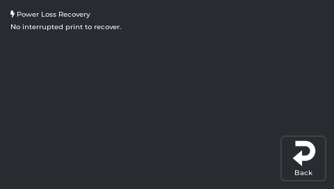

| Section | What it does |
|---|---|
| **Power devices** | On/off buttons for any smart plugs or relays configured in Moonraker. **If none are configured, this section doesn't appear at all** — no placeholder text, it's just not there. |
| **Power Loss Recovery** | Resume a print that was interrupted by a power cut. **Not automatic** — after power comes back, you have to open this screen yourself. It reads Creality's own saved print-state file to find something to resume, so it isn't a GuppyKE-invented feature; if that file is missing or stale, there's nothing to offer. Three things you might see here: (1) if a print is currently running, "A print is running. If power is lost, reopen this screen to resume." — that's the reminder of what to do; (2) if nothing is recoverable, "No interrupted print to recover."; (3) if something is recoverable, a **Resume** button (reheats and returns to the saved position — a real resume, not a restart) and a **Dismiss** button (clears the prompt without printing). If the saved position turns out invalid, it safely restarts the file from the beginning instead of crashing. |

### TMC Metrics

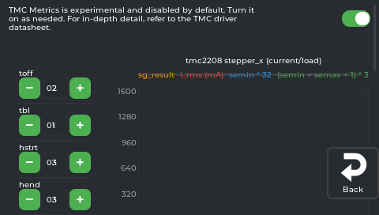

The panel itself says it best: **"TMC Metrics is experimental and disabled by default."** There's a
toggle at the top — it's off unless you turn it on (turning it on/off loads or unloads a separate
Klipper diagnostics module, so there's a real reason it isn't always running).

⚠️ **This is not just a read-only diagnostics screen.** Once enabled, each stepper shows a live graph
(`sg_result`, `i_rms` in mA, and two other computed values — the panel doesn't explain what these mean
beyond their names; the app's own advice is "refer to the TMC driver datasheet") plus **four adjustable
values**: `toff` (0–15), `tbl` (0–3), `hstrt` (0–7), `hend` (0–15) — these are raw TMC chopper-timing
register names. Tapping +/- on any of them sends the change to the driver **immediately, live** — it is
not a preview you confirm afterward. There's no indication these persist across a restart on their own.

Given the app's own "experimental" label and that these are low-level hardware timing values, don't
adjust them unless you specifically know what you're doing (per the driver datasheet) — this isn't
needed for normal printing or normal troubleshooting. If you suspect a driver issue, **TMC Autotune**
(inside the **Calibration** hub below) is the supported way to tune your drivers.

### Calibration

A single hub for every calibration routine, reached from the **Calibration** tile. Replaces what used
to be four separate Tune-tab tiles (Input Shaper, Axis Twist, Skew, TMC Autotune) plus a since-retired
Belts/Shake screen (mechanically dead-ended and no longer reachable from anywhere in the app). Opens as
a numbered, scrollable list matching the order the [Calibration Explained](Calibration-Explained) guide
recommends doing these in, followed by an unordered **Other** section for routine (non-calibration)
tools:

| # | Step | Opens |
|---|---|---|
| 1 | **Axis Twist** | Axis Twist Compensation wizard |
| 2 | **Z-Offset & Bed Mesh** | The guided Recalibration Wizard |
| 3 | **Input Shaper** | Input Shaper calibration |
| 4 | **E-Steps Calibration** | The guided E-Steps wizard |
| 5 | **Skew Correction** | Skew Correction |
| 6 | **TMC Autotune** *(optional)* | TMC Autotune |
| — | **Bed Mesh** *(Other)* | The same Bed Mesh panel as the Tune-tab tile above — view or re-mesh standalone without redoing the whole wizard |

Tapping **Axis Twist** or **Skew Correction** when their Klipper config section isn't present shows a
toast instead of opening the panel, same as before when they were their own tiles. Tapping any row
while a print is running shows the usual "locked during print" notice instead of opening it.

#### Z-Offset & Bed Mesh (Recalibration Wizard)

The guided, combined replacement for doing Z-offset and bed-mesh calibration as two separate manual
steps: paper-test (or BLTouch) Z-offset → automatic bed mesh → review/save, with an optional
load-cell-assisted refine step along the way. Full walkthrough:
[Calibration Explained](Calibration-Explained).

#### Input Shaper

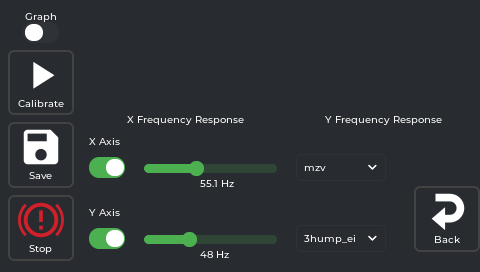

Reduces ghosting/ringing (echoes trailing sharp corners at speed). The panel has 3 buttons on the left
(**Calibrate**, **Save**, **Stop**) and, per axis, a toggle switch, a frequency value, and a shaper-type
dropdown (populated with whatever shaper types Klipper supports — e.g. `mzv`, `ei`, `3hump_ei`, `zv`).

- **X switch / Y switch** — turn an axis **on or off for the next Calibrate run**, not "enable/disable
  shaping" on that axis. Turn one off if you only want to re-test the other. Both are on by default.
- **Graph switch** (top) — off by default. Turn it on **before** tapping Calibrate if you want an actual
  plotted frequency-response curve rendered after the sweep; leave it off for a faster run that just
  gives you the recommended frequency + shaper type as numbers/dropdown, no picture.
- **Stop** is a general **emergency stop** (same action as everywhere else in the app) — it is not a
  "cancel this specific calibration" button.

Typical flow:

1. Leave both axis switches on (or turn one off if you only want to redo one axis). Optionally turn
   **Graph** on if you want to see the curve.
2. Tap **Calibrate** — the printer sweeps frequencies on the selected axis/axes (~1 minute).
3. The frequency value and shaper-type dropdown update with the recommended result for each axis you
   tested. You can change the dropdown yourself before saving if you want to try a different shaper type.
4. Tap **Save** to persist your choices.

> 💡 For the **Y axis** test: move the accelerometer to the **bed** (it must be on whatever moves for
> that axis). Tape or zip-tie it on for the 1-minute test.

#### Axis Twist

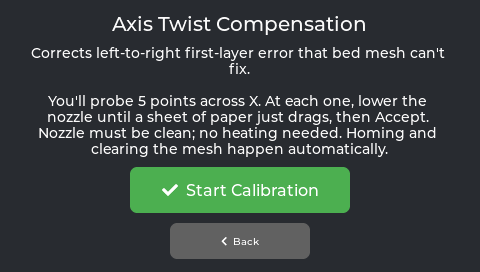

Launches the 5-point calibration wizard for Axis Twist Compensation. Fixes first layers that are
uneven left-to-right despite re-meshing. Full guide: [Axis Twist Compensation](Axis-Twist-Compensation).

#### E-Steps Calibration

A guided version of the classic mark-extrude-measure rotation-distance calibration:

1. Heats the extruder to a safe temperature for you.
2. Marks the filament, then tap **Extrude** to push a fixed length through.
3. Measure how far the mark actually moved (calipers or a ruler) and type it in on the numeric keypad.
4. The panel computes and applies the corrected `rotation_distance` for you — no manual math.

Auto-cancels if left idle for 2 minutes (e.g. mid-measurement) rather than leaving the extruder primed
indefinitely. If the corrected value keeps changing significantly between repeat runs, that points to a
hardware issue (extruder gears/tension), not something this calibration itself can fix. Full guide:
[Calibration Explained](Calibration-Explained).

#### Skew

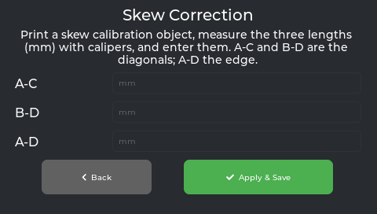

Corrects parts that come out as slight parallelograms instead of squares.

- Enter three caliper measurements from a printed test square: **AC diagonal**, **BD diagonal**, **AD side**.
- Tap **Apply & Save** — this sends the correction *and* saves it in one step. You don't need to run
  `SAVE_CONFIG` separately; the button already does that for you.

Full guide: [Skew Correction](Skew-Correction).

#### TMC Autotune

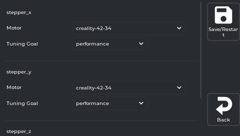

Quieter, cooler, sometimes smoother steppers. Select motor type and a goal, tap **Save/Restart**:

- **Performance** — prioritises current/torque (slightly louder)
- **Silent** — prioritises quiet operation

Settings are saved and reapplied every boot.

> The row is **disabled** until the TMC Autotune module is installed (the installer does this during
> the print-quality mods step). Full guide: [TMC Autotune](TMC-Autotune).

---

## Settings tab

A **4-column × 2-row grid of icon buttons** plus a quick-action restart row at the top. Nothing is
configured inline on this tab.

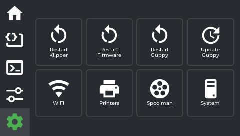

### Quick-action row (top row)

These execute immediately — no sub-panel opens:

| Button | What it does |
|---|---|
| **Restart Klipper** | Restarts the Klipper host process. Use after editing `printer.cfg`. |
| **Restart Firmware** | Resets the mainboard MCU (`FIRMWARE_RESTART`). Use after MCU-level config changes. |
| **Restart Guppy** | Restarts the OpenKE screen process only (not Klipper). Use if the UI feels stuck. |
| **Update Guppy** | Downloads and installs the latest OpenKE screen binary. **Note:** only swaps the binary — for full updates (Klipper mods, adaptive mesh config, etc.) re-run the full installer. |

### Navigation row (main row)

| Button | Opens |
|---|---|
| **WIFI** | WiFi connection panel |
| **Printers** | Printer connection manager |
| **Spoolman** | Filament tracking panel |
| **System** | Screen settings + info panel |

---

## WiFi panel

Opens from Settings → **WIFI**.

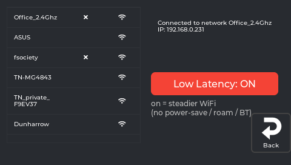

Networks are grouped into two lists — **KNOWN NETWORKS** (anything with a saved password) and **OTHER
NETWORKS IN RANGE** — each row showing 4 signal-strength bars derived from the scan's RSSI. Rescans
automatically on open; scan results are merged across scans (a network has to miss 3 scans in a row
before it's dropped) so the list doesn't visibly reshuffle or shrink between scans the way a
clear-and-redraw would.

Each row's tap targets are different depending on what it is — this was a deliberate fix (an earlier
layout packed a status icon and an edit icon into two adjacent narrow columns, and a mistap between
them could delete a saved password instead of opening network settings):

| Row type | Tapping the row body | Extra affordance |
|---|---|---|
| **Connected network** | Opens [Network Details](#network-details-panel) | A chevron (**›**) on the right — purely a visual hint, the whole row does the same thing |
| **Known, not connected** | Reconnects to it | A separately-spaced **✕** box — tap to **forget** it (asks you to confirm first; this deletes the saved password) |
| **Not known (in range only)** | Prompts for a password to connect | *(none)* |

**Password entry** has an **eye-toggle** button to reveal/hide what you're typing.

**Low Latency** is a compact link near the bottom (not a screen-dominating control) that reads "Low
Latency: ON/OFF". Disables WiFi power-save, idle sleep, background roam scans, and **Bluetooth**. The
KE's WiFi and Bluetooth share one 2.4 GHz radio and antenna — leaving BT on (it's unused) makes WiFi
yield to it periodically and stutter. Low Latency eliminates that. Persists across reboots. Turn off to
re-enable Bluetooth.

> If Mainsail feels laggy, the camera stutters, or tap response feels slow — enable **Low Latency** first.

---

## Network Details panel

Reached by tapping the connected network's row (or its chevron) in the WiFi panel.

An info card (**Signal**, **Security**, **IP address**) for the connected network, plus two clearly
labelled buttons:

- **Configure Static IP** — opens the [Static IP panel](#static-ip-panel) below.
- **Forget This Network** (red outline) — deletes the saved password for this network. Same destructive
  action as the ✕ on a known-but-unconnected row in the WiFi panel, just reached from here instead.

**Back** returns to the WiFi panel.

---

## Static IP panel

Reached from Network Details → **Configure Static IP**.

Titled **"Static IP - `<network name>`"** — the config applies to that specific saved network, not
globally. **DHCP** / **Manual** is a plain view switch at the top (tapping between them doesn't change
anything on its own — it just shows different controls).

**Manual** view: 4 address rows — **IP**, **Netmask**, **Gateway**, **DNS** — each entered as **4
separate tap-sized octet boxes** (not one free-text field). Typing an invalid value (outside 0–255)
flags that box red immediately, in place, rather than only failing when you try to save.

- **✓ Save** is pinned outside the scrollable field area, so it's always reachable and can never scroll
  out of view.
- Already have a static config? A **Revert to DHCP** button appears — a separate, explicit action (with
  its own Revert/Cancel confirmation) rather than something that happens as a side effect of switching
  back to the DHCP tab.

**Back** returns to Network Details.

---

## Printers panel

Opens from Settings → **Printers**. Manages Moonraker connections.

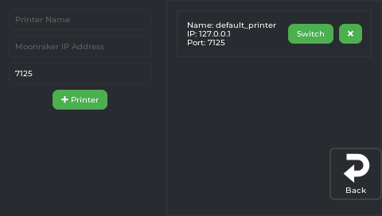

Each configured printer is shown as a card with its name, IP, and port, plus:

- **Switch** — reconnects OpenKE to that printer
- **✕ (close icon)** — removes it from the config. Asks you to tap **Confirm** or **Cancel** first;
  there's no text label on the button itself, just the ✕ icon.

**Add a printer:** on the left, fill in **Printer Name**, **Moonraker IP Address**, and the port field
(pre-filled with `7125`), then tap the green **+ Printer** button. A keyboard appears for text entry.

---

## Spoolman panel

Opens from Settings → **Spoolman**. Requires a [Spoolman](https://github.com/Donkie/Spoolman) server
on your network — the button is greyed out until one is configured.

| Feature | What it does |
|---|---|
| **Spool list** | A table with columns **ID**, **Name**, **MAT** (material), **Remain Weight**, **Remain Length**, plus a colour swatch per spool. |
| **Set active** | Each non-archived, non-active row has a ▶ (play) icon in its row — tap it to make that spool active. The active row shows "(active)" instead of an icon. The active spool's filament use is deducted as you print. |
| **Archive** | A non-active, non-archived spool shows a 💾-style icon in its row — tap it to archive. An archived spool shows an ⬆-style icon instead — tap it to bring it back. You can't archive the currently active spool. **Show Archived** (a switch **below** the table, next to Reload/Back) toggles whether archived spools are listed at all. |
| **Reload** | Re-fetches the spool list from your Spoolman server. |
| **Auto tracking** | Once a spool is active, filament used by prints is subtracted automatically. No weighing. |
| **Wrong-filament check** | Before a print starts (and before a manual Load), a **"Use this filament?"** popup shows the active spool. Prevents "oops, wrong material" before it ruins a print. |

---

## System panel

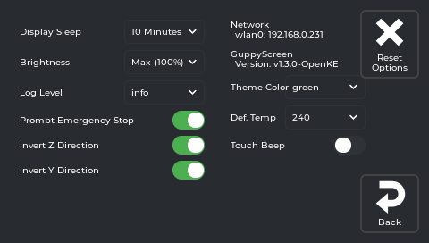

Opens from Settings → **System**. This is the main settings panel for the screen itself — everything
that changes how OpenKE behaves.

**Network info label** (top of right column): shows each network interface and its IP address, plus the
currently running OpenKE version. Read-only.

### Left column

| Setting | Options | What it does |
|---|---|---|
| **Display Sleep** | Never / 30 Seconds / 1 Minute / 5 Minutes / 10 Minutes / 30 Minutes / 1 Hour | Dims the screen after this period of inactivity. Touch to wake. |
| **Brightness** | Low (10%) / Dim (25%) / Medium (50%) / Bright (75%) / Max (100%) | Backlight brightness. 10% is the minimum readable level. |
| **Log Level** | trace / debug / info / warn | Verbosity of `guppyscreen.log`. **info** is the default (weeks-long logs). Use **debug** before reporting a bug, then switch back. **warn** = errors only (smallest logs). **trace** = developer use only. |
| **Prompt Emergency Stop** | Toggle | **On:** tapping Emergency Stop shows a confirmation dialog first. **Off:** acts immediately, no dialog. Default on. |
| **Invert Z Direction** | Toggle | Flips Z jog buttons in the movement panel (up/down). |
| **Invert Y Direction** | Toggle | Flips Y jog buttons (front/back). Useful if the bed moves opposite to your expectation on a bed-slinger. |

### Right column

| Setting | Options | What it does |
|---|---|---|
| **Theme Color** | Blue, Red, Green, Purple, Pink, Yellow | Changes the screen colour scheme. Takes effect immediately. |
| **Def. Temp** | Preset temperatures | Default extruder target used by Load/Unload when no explicit target has been set (e.g. on a cold boot). |
| **Touch Beep** | Toggle | Plays a short click sound through the buzzer on every tap. A test beep plays immediately when you enable it. |

### Reset Options

Tap the **Reset Options** button (top-right corner of the System panel) to open a dialog with three choices:

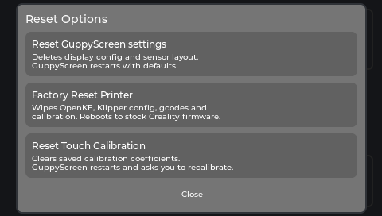

| Option | What it does |
|---|---|
| **Reset GuppyScreen settings** | Deletes the screen config and sensor layout (`guppyconfig.json`). OpenKE restarts with factory defaults. Your Klipper config and print files are **not** touched. |
| **Factory Reset Printer** | Wipes OpenKE, all Klipper config, gcodes, and calibration. Reboots to stock Creality firmware. **Irreversible.** WiFi and Creality cloud account are preserved. See [Resetting & Uninstalling](Resetting-and-Uninstalling). |
| **Reset Touch Calibration** | Clears saved calibration. OpenKE restarts and shows the 9-tap calibration wizard immediately. |

Tap **Close** to dismiss without doing anything.

**Back** button (bottom-right of the System panel) returns to the Settings tab.
